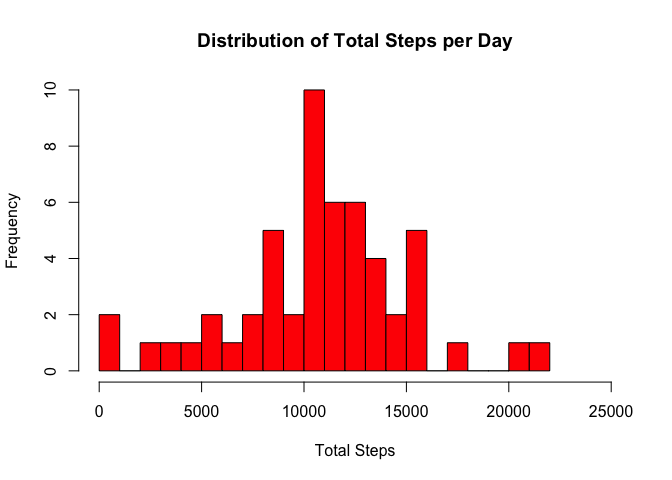
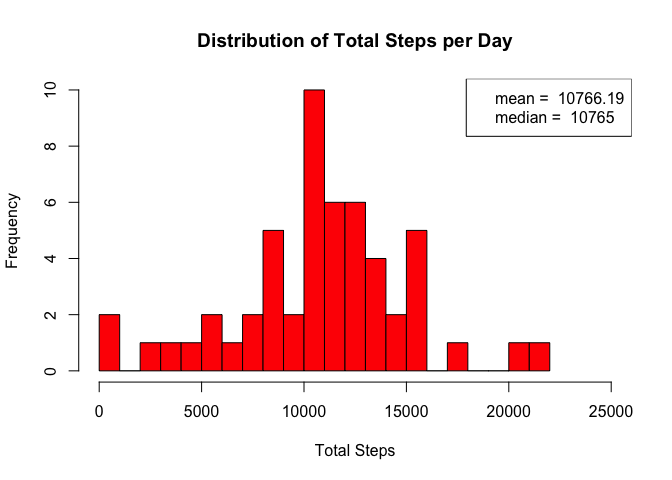
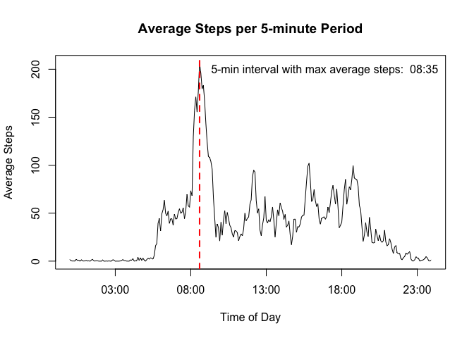
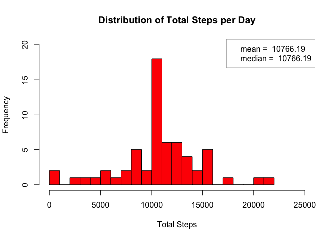
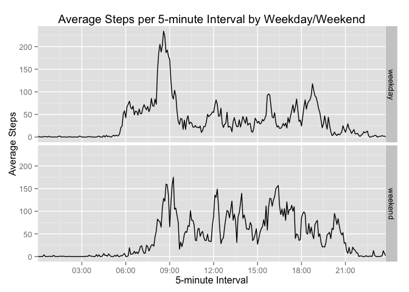

# Reproducible Research: Peer Assessment 1

Author:  louise.mateos@sbcglobal.net

## Introduction  

This assignment makes use of data from a personal activity monitoring device. 
This device collects data at 5 minute intervals throughout the day. The data 
consists of two months of data from an anonymous individual collected during 
the months of October and November, 2012, and include the number of steps 
taken in 5 minute intervals each day.  

The data for this assignment was obtained by forking the course github 
repository: https://github.com/rdpeng/RepData_PeerAssessment1

## Loading and preprocessing the data  

The following code is used to load the data (for the file located in the current
directory):  

```r
unzip("activity.zip", exdir = ".")
mydata <- read.csv("activity.csv")
```

The following code is used to view the structure of the data:  

```r
str(mydata)
```

```
## 'data.frame':	17568 obs. of  3 variables:
##  $ steps   : int  NA NA NA NA NA NA NA NA NA NA ...
##  $ date    : Factor w/ 61 levels "2012-10-01","2012-10-02",..: 1 1 1 1 1 1 1 1 1 1 ...
##  $ interval: int  0 5 10 15 20 25 30 35 40 45 ...
```

## What is mean total number of steps taken per day?  

The following code calculates the total number of steps taken per day:  

```r
library(dplyr)
mysums <- aggregate(mydata$steps, list(mydata$date), sum)
```

Here is a histogram of the total number of steps taken each day:  

```r
hist(mysums$x, 
     breaks = 20, 
     col = "red", 
     main = "Distribution of Total Steps per Day", 
     xlab = "Total Steps", 
     xlim = c(0,25000))
```

 

The following code calculates and reports the mean and median of the total 
number of steps taken per day and adds to the histogram:  

```r
mysums_mean <- mean(mysums$x, na.rm = TRUE)
mysums_median <- median(mysums$x, na.rm = TRUE)

exp12 <- paste("mean = ", 
               as.character(format(mysums_mean, nsmall = 2)))
exp22 <- paste("median = ",
               as.character(format(mysums_median, nsmall = 2)))
hist(mysums$x, 
     breaks = 20, 
     col = "red", 
     main = "Distribution of Total Steps per Day", 
     xlab = "Total Steps", 
     xlim = c(0,25000))
legend("topright", legend = c(exp12, exp22))
```

 

## What is the average daily activity pattern?  

The following code calculates the average (mean) steps for each 5-minute 
interval across days:  

```r
myinterval_means <- aggregate(mydata$steps, 
                              list(mydata$interval), 
                              mean, 
                              na.rm = TRUE)
```
In order to treat the intervals as time, the following code performs the 
conversions:

```r
## Convert intervals to time of day in hours and minutes
library(lubridate)
myinterval_means <- mutate(myinterval_means, 
                           hour = Group.1 %/% 100, 
                           minute = Group.1 %% 100)

myinterval_means$time <- as.POSIXct("2015-05-15 0:0:0")
hour(myinterval_means$time) <- myinterval_means$hour
minute(myinterval_means$time) <- myinterval_means$minute
```

The following code makes a time series plot (i.e. type = "l") of the 5-minute 
interval (x-axis) and the average number of steps taken, averaged across all 
days (y-axis):  

```r
plot(myinterval_means$time, 
     myinterval_means$x, 
     type = "l",
     main = "Average Steps per 5-minute Period",
     xlab = "Time of Day",
     ylab = "Average Steps")
```

 

The following code selects which 5-minute interval, on average across all the 
days in the dataset, contains the maximum number of steps, and adds to the plot:  

```r
busytime <- myinterval_means$time[myinterval_means$x==max(myinterval_means$x)]

plot(myinterval_means$time, 
     myinterval_means$x, 
     type = "l",
     main = "Average Steps per 5-minute Period",
     xlab = "Time of Day",
     ylab = "Average Steps")

abline(v = busytime,
       col = "red",
       lty = 2,
       lwd = 2)

exp13 <- paste("5-min interval with max average steps: ", 
               as.character(format(busytime, "%H:%M")))

legend("topright", exp13,  bty = "n")
```

 

## Imputing missing values  

The following code calculates and reports the total number of missing values in 
the dataset (i.e. the total number of rows with NAs):  

```r
mysteps <- summary(mydata$steps)
mysteps[7]
```

```
## NA's 
## 2304
```

My strategy for filling in NAs is to use the mean for the 5-minute interval 
across all days calculated above (in myinterval_means).  

The following code creates a new dataset that is equal to the original dataset 
but with the missing data filled in using my strategy:  

```r
mydata$filledsteps <- mydata$steps
for (i in 1:length(mydata$filledsteps)) {
        if (is.na(mydata$filledsteps[i])) {
                mydata$filledsteps[i] <- 
                        myinterval_means$x[myinterval_means$Group.1 == mydata$interval[i]]
        }   
}
```

The following code makes a histogram of the total number of steps taken each 
day and calculates and reports the mean and median total number of steps taken 
per day: 

```r
## Calculate the total number of steps taken per day
myfilledsums <- aggregate(mydata$filledsteps, list(mydata$date), sum)

## Make a histogram of the total number of steps taken each day
hist(myfilledsums$x, 
     breaks = 20, 
     col = "red", 
     main = "Distribution of Total Steps per Day", 
     xlab = "Total Steps", 
     xlim = c(0,25000),
     ylim = c(0,20))

## Calculate and report the mean and median of the total number of steps 
## taken per day
myfilledsums_mean <- mean(myfilledsums$x)
myfilledsums_median <- median(myfilledsums$x)

exp14 <- paste("mean = ", 
               as.character(format(myfilledsums_mean, nsmall = 2)))
exp24 <- paste("median = ",
               as.character(format(myfilledsums_median, nsmall = 2)))

legend("topright", legend = c(exp14, exp24))
```

 

Do these values differ from the estimates from the first part of the assignment?
What is the impact of imputing missing data on the estimates of the total daily 
number of steps?  

The following code calculates the difference between the means/medians of the
original data and the means/medians of the data with imputed values:  

```r
meandiff <- mysums_mean - myfilledsums_mean
meandiff
```

```
## [1] 0
```

```r
mediandiff <- mysums_median - myfilledsums_median
mediandiff
```

```
## [1] -1.188679
```

## Are there differences in activity patterns between weekdays and weekends? 

The following code creates a new factor variable in the dataset with two levels,
“weekday” and “weekend”s indicating whether a given date is a weekday or weekend 
day:  

```r
mydata<-mutate(mydata,
               day=ifelse((weekdays(as.POSIXct(mydata$date)) == "Saturday" 
                           | weekdays(as.POSIXct(mydata$date)) == "Sunday"),
                          "weekend",
                          "weekday"))

mydata$day <- as.factor(mydata$day)
```

The following code makes a panel plot containing a time series plot 
(i.e. type = "l") of the 5-minute interval (x-axis) and the average number of 
steps taken, averaged across all weekday days or weekend days (y-axis).  

```r
## Calculate the average (mean) steps for each 5-minute interval across days by
## day type
myinterval_meansbyday <- aggregate(mydata$steps, 
                                   list(mydata$interval, mydata$day), 
                                   mean, 
                                   na.rm = TRUE)

## Convert intervals to time of day in hours and minutes
myinterval_meansbyday <- mutate(myinterval_meansbyday, 
                                hour = Group.1 %/% 100, 
                                minute = Group.1 %% 100)

myinterval_meansbyday$time <- as.POSIXct("2015-05-15 0:0:0")
hour(myinterval_meansbyday$time) <- myinterval_meansbyday$hour
minute(myinterval_meansbyday$time) <- myinterval_meansbyday$minute
myinterval_meansbyday$time <- as.POSIXct(myinterval_meansbyday$time, 
                                         format = "%H:%M")

## Create a panel plot containing time series plot of average steps by day type
library(ggplot2)
p <- ggplot(myinterval_meansbyday, aes(time, x))
p <- p + geom_line() + facet_grid(Group.2 ~.)
p <- p + ggtitle("Average Steps per 5-minute Interval by Weekday/Weekend") +
        xlab("5-minute Interval") + 
        scale_x_datetime(limits = c(myinterval_meansbyday$time[14],
          myinterval_meansbyday$time[length(myinterval_meansbyday$time)-15])) +
        ylab("Average Steps")
p
```

 
